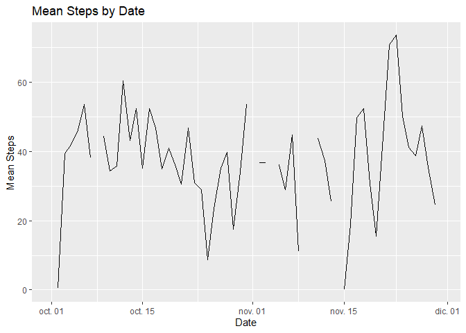

## Loading and preprocessing the data


1. Load the data

First of all we have to unzip the CSV file and prepare our dataset for the first exploration.


```r
unzip("./activity.zip")

monitoring<-read.csv("./activity.csv",header = TRUE)
```

2. Process/transform the data (if necessary) into a format suitable for your analysis

The next step is to make a little exploration to check if it is possible to perform and analysis of the data.


```r
summary(monitoring)
```

```
##      steps                date          interval     
##  Min.   :  0.00   2012-10-01:  288   Min.   :   0.0  
##  1st Qu.:  0.00   2012-10-02:  288   1st Qu.: 588.8  
##  Median :  0.00   2012-10-03:  288   Median :1177.5  
##  Mean   : 37.38   2012-10-04:  288   Mean   :1177.5  
##  3rd Qu.: 12.00   2012-10-05:  288   3rd Qu.:1766.2  
##  Max.   :806.00   2012-10-06:  288   Max.   :2355.0  
##  NA's   :2304     (Other)   :15840
```

```r
str(monitoring)
```

```
## 'data.frame':	17568 obs. of  3 variables:
##  $ steps   : int  NA NA NA NA NA NA NA NA NA NA ...
##  $ date    : Factor w/ 61 levels "2012-10-01","2012-10-02",..: 1 1 1 1 1 1 1 1 1 1 ...
##  $ interval: int  0 5 10 15 20 25 30 35 40 45 ...
```

We could se that the date column is a factor and we need a date to move in the analysis.


```r
monitoring$date <- as.Date(monitoring$date, format = "%Y-%m-%d")

str(monitoring)
```

```
## 'data.frame':	17568 obs. of  3 variables:
##  $ steps   : int  NA NA NA NA NA NA NA NA NA NA ...
##  $ date    : Date, format: "2012-10-01" "2012-10-01" ...
##  $ interval: int  0 5 10 15 20 25 30 35 40 45 ...
```


## What is mean total number of steps taken per day?

#### Needed library load


```r
library(dplyr)
```

```
## 
## Attaching package: 'dplyr'
```

```
## The following objects are masked from 'package:stats':
## 
##     filter, lag
```

```
## The following objects are masked from 'package:base':
## 
##     intersect, setdiff, setequal, union
```

1. Calculate the total number of steps taken per day


```r
steps_by_day <- monitoring %>% group_by(date) %>% summarize(total_steps = sum(steps, na.rm=TRUE))
```

2. If you do not understand the difference between a histogram and a barplot, research the difference between them. Make a histogram of the total number of steps taken each day


```r
hist(steps_by_day$total_steps, col="yellow", main = "Total steps frequency", xlab="Total steps")
```

<!-- -->

3. Calculate and report the mean and median of the total number of steps taken per day

The mean of the dataset is:


```r
steps_mean <- mean(steps_by_day$total_steps)

print(steps_mean)
```

```
## [1] 9354.23
```

The median of the dataset is:


```r
steps_median <- median(steps_by_day$total_steps)

print(steps_median)
```

```
## [1] 10395
```


## What is the average daily activity pattern?

#### Needed library load


```r
library(ggplot2)
library(plotly)
```

```
## Warning: package 'plotly' was built under R version 3.6.2
```

```
## 
## Attaching package: 'plotly'
```

```
## The following object is masked from 'package:ggplot2':
## 
##     last_plot
```

```
## The following object is masked from 'package:stats':
## 
##     filter
```

```
## The following object is masked from 'package:graphics':
## 
##     layout
```


1. Make a time series plot (i.e. \color{red}{\verb|type = "l"|}type="l") of the 5-minute interval (x-axis) and the average number of steps taken, averaged across all days (y-axis)


```r
mean_by_day <- monitoring %>% group_by(date) %>% summarize(mean_steps = mean(steps, na.rm=TRUE))

p <- ggplot(mean_by_day, aes(x = date, y = mean_steps)) + geom_line() + 
        ggtitle("Mean Steps by Date") + xlab("Date") + ylab("Mean Steps")

p
```

```
## Warning: Removed 2 rows containing missing values (geom_path).
```

<!-- -->


2. Which 5-minute interval, on average across all the days in the dataset, contains the maximum number of steps?


```r
mean_by_interval <- monitoring %>% group_by(interval) %>% summarize(mean_value = mean(steps, na.rm=TRUE))

filter(mean_by_interval, mean_by_interval$mean_value == max(mean_by_interval$mean_value))
```

```
## # A tibble: 1 x 2
##   interval mean_value
##      <int>      <dbl>
## 1      835       206.
```


## Imputing missing values


1. Calculate and report the total number of missing values in the dataset (i.e. the total number of rows with \color{red}{\verb|NA|}NAs)


```r
sum(is.na(monitoring$steps))
```

```
## [1] 2304
```

2. Devise a strategy for filling in all of the missing values in the dataset. The strategy does not need to be sophisticated. For example, you could use the mean/median for that day, or the mean for that 5-minute interval, etc.

Frist we are goint to create a function which will get the mean of the interval of the dataset.


```r
get.mean.by.interval <-function(interval_number){
        filter(mean_by_interval, mean_by_interval$interval==interval_number)$mean_value
}
```

3. Create a new dataset that is equal to the original dataset but with the missing data filled in.


```r
monitoring.full <- monitoring

for (i in 1:nrow(monitoring.full)){
        if (is.na(monitoring.full[i,]$steps)){
                monitoring.full[i,]$steps <- get.mean.by.interval(monitoring.full[i,]$interval)
        }
        
}
```

4. Make a histogram of the total number of steps taken each day and Calculate and report the mean and median total number of steps taken per day. Do these values differ from the estimates from the first part of the assignment? What is the impact of imputing missing data on the estimates of the total daily number of steps?


```r
steps_by_day.full <- monitoring.full %>% group_by(date) %>% summarize(total_steps = sum(steps, na.rm=TRUE))

hist(steps_by_day.full$total_steps, col="yellow", main = "Total steps frequency", xlab="Total steps")
```

<!-- -->

The new values are calculated


```r
steps_median.full <- median(steps_by_day.full$total_steps)
steps_mean.full <- mean(steps_by_day.full$total_steps)
```

If we compare the **median**


```r
print(steps_median)
```

```
## [1] 10395
```

```r
print(steps_median.full)
```

```
## [1] 10766.19
```

And If we compare the **mean**


```r
print(steps_mean)
```

```
## [1] 9354.23
```

```r
print(steps_mean.full)
```

```
## [1] 10766.19
```


## Are there differences in activity patterns between weekdays and weekends?

#### Needed library load


```r
library(timeDate)
library(plyr)
```

```
## ------------------------------------------------------------------------------
```

```
## You have loaded plyr after dplyr - this is likely to cause problems.
## If you need functions from both plyr and dplyr, please load plyr first, then dplyr:
## library(plyr); library(dplyr)
```

```
## ------------------------------------------------------------------------------
```

```
## 
## Attaching package: 'plyr'
```

```
## The following objects are masked from 'package:plotly':
## 
##     arrange, mutate, rename, summarise
```

```
## The following objects are masked from 'package:dplyr':
## 
##     arrange, count, desc, failwith, id, mutate, rename, summarise,
##     summarize
```

1. Create a new factor variable in the dataset with two levels – “weekday” and “weekend” indicating whether a given date is a weekday or weekend day.


```r
monitoring.full$typeday <- isWeekday(monitoring.full$date)

monitoring.full$typeday <- as.factor(monitoring.full$typeday)

monitoring.full$typeday <- revalue(monitoring.full$typeday, c("FALSE"="weekend", "TRUE"="weekday"))

str(monitoring.full)
```

```
## 'data.frame':	17568 obs. of  4 variables:
##  $ steps   : num  1.717 0.3396 0.1321 0.1509 0.0755 ...
##  $ date    : Date, format: "2012-10-01" "2012-10-01" ...
##  $ interval: int  0 5 10 15 20 25 30 35 40 45 ...
##  $ typeday : Factor w/ 2 levels "weekend","weekday": 2 2 2 2 2 2 2 2 2 2 ...
```


2. Make a panel plot containing a time series plot (i.e. \color{red}{\verb|type = "l"|}type="l") of the 5-minute interval (x-axis) and the average number of steps taken, averaged across all weekday days or weekend days (y-axis). See the README file in the GitHub repository to see an example of what this plot should look like using simulated data.


```r
steps_by_typeday.full <- aggregate(monitoring.full$steps ~ monitoring.full$interval + monitoring.full$typeday, monitoring.full, mean)

ggplot(steps_by_typeday.full, 
       aes(x = steps_by_typeday.full$`monitoring.full$interval`, y = steps_by_typeday.full$`monitoring.full$steps`))       + geom_line() + facet_wrap(~steps_by_typeday.full$`monitoring.full$typeday`) 
```

<!-- -->


